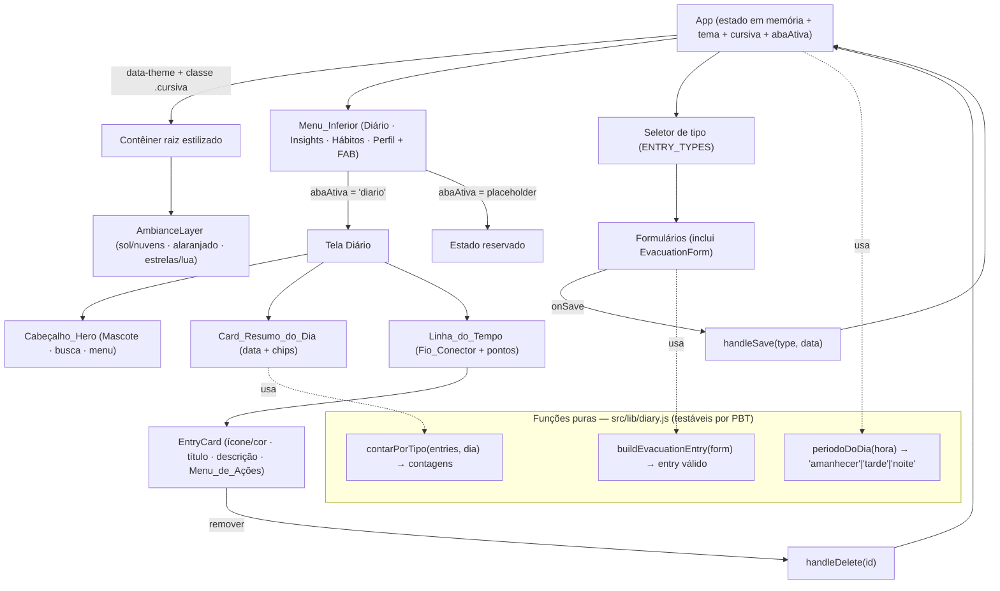

# Documento de Design

## Visão Geral

Este design cobre o **incremento de redesign visual** do protótipo *Diário Intestinal* (timelinegut) e implementa as entregas definidas em `requirements.md`, orientadas por uma referência de design aprovada:

1. **Temas de ambiência por horário** (Amanhecer 05–11h, Tarde 12–17h, Noite 18–04h, com Noite como *fallback*).
2. **Nova identidade visual verde** (acentos de marca em verde, preservados sobre todos os temas; substitui a antiga base terracota).
3. **Redesign da tela do Diário** — Cabeçalho_Hero com Mascote, Card_Resumo_do_Dia e Linha_do_Tempo com Fio_Conector.
4. **Menu de navegação inferior** — Diário · Insights · Hábitos · Perfil + botão de adicionar central; apenas Diário funcional.
5. **Fonte cursiva opcional** — ligada por padrão, alternável, com fallback cursivo; estado em memória da sessão.
6. **Registro de Evacuação** — mantido, com visual alinhado ao verde.
7. **Guarda-corpo regulatório** — rótulos da Escala de Bristol estritamente descritivos.

### Princípio orientador: extensão do componente existente

O aplicativo atual é um **componente único** (`src/App.jsx`) com estado em memória via `useState`, estilizado com Tailwind 4. Este incremento **reestiliza e estende** esse componente, sem introduzir backend, persistência ou bibliotecas de estado novas:

- **Sem backend, sem persistência, sem banco de dados.** Todo estado continua em memória (`useState`/`useRef`).
- **Tema via `data-theme` + variáveis CSS.** A troca de ambiência é uma única mutação de atributo no contêiner raiz.
- **Identidade verde via tokens CSS.** Os acentos de marca ficam em variáveis (`--brand`, `--brand-deep`, ...) em `src/index.css`, coerentes sobre qualquer tema.
- **Funções puras extraídas** para `src/lib/diary.js`, facilitando os testes (PBT) e mantendo `App.jsx` livre de exports não-componente.

### Resumo das decisões de design

| Tema de decisão | Escolha | Justificativa |
|---|---|---|
| Como aplicar o tema | Atributo `data-theme` no contêiner raiz + variáveis CSS | Troca de tema sem re-render em cascata; preserva tokens e classes |
| Onde calcular o período | Função pura `periodoDoDia(hora)` + `useState` inicial em `App` | Função total testável por PBT; cálculo síncrono no primeiro render (RF 1.2) |
| Identidade verde | Tokens CSS (`--brand`, `--brand-deep`, `--surface`, `--card`) | Acentos de marca coerentes sobre os três temas (RF 1.9) |
| Fonte cursiva | Classe no contêiner raiz + variável `--fonte-registro`, **ligada por padrão** | RF 4.1; alternável sem mexer em layout/cores (RF 4.6) |
| Linha do tempo conectada | Fio vertical + ponto colorido por registro (`ENTRY_TYPES[type].color`) | RF 2.4 |
| Remover registro | `handleDelete(id)` no `App` | RF 2.6/2.7; operação em memória |
| Menu inferior | Estado `abaAtiva` + render condicional; abas não-Diário mostram placeholder | RF 3.6 |
| Evacuação | `ENTRY_TYPES` + `EvacuationForm` + `buildEvacuationEntry` | Reaproveita o *pipeline* existente |
| Bristol descritivo | Tabela `BRISTOL_DESCRICOES` com texto factual | Centraliza o guarda-corpo num único ponto de verdade |

---

## Arquitetura

### Estrutura após o incremento



### Camadas de responsabilidade

1. **Camada de tema (ambiência):** `periodoDoDia(horaLocalAtual())` determina o período no primeiro render; o resultado vira `data-theme` no contêiner raiz. Variáveis CSS por tema definem a ambiência de fundo, e a `AmbianceLayer` (decorativa, `aria-hidden`, `pointer-events:none`) é renderizada atrás do conteúdo.
2. **Camada de identidade (verde):** tokens CSS centralizam os acentos de marca, aplicados de forma coerente sobre qualquer tema (RF 1.9).
3. **Camada de tipografia (cursiva):** um booleano em memória (`cursiva`, padrão `true`) alterna a classe `.cursiva`; `--fonte-registro` troca a fonte de títulos e textos de registro, sem mudar layout/cores.
4. **Camada de navegação:** `abaAtiva` controla qual tela é exibida; apenas `'diario'` renderiza a Linha_do_Tempo; as demais renderizam um placeholder inerte.
5. **Camada de captura (registros + evacuação):** *pipeline* `seletor → bottom-sheet → onSave → handleSave → entries`, com `handleDelete` para remoção.
6. **Camada de conteúdo (guarda-corpo):** constantes centralizadas garantem que todo Texto_Descritivo contenha apenas atributos observáveis.

### Cálculo e aplicação do tema

```
periodoDoDia(hora):
  se hora não é inteiro em [0, 23]  → 'noite'      (fallback, RF 1.11)
  senão se 5  <= hora <= 11         → 'amanhecer'  (RF 1.3)
  senão se 12 <= hora <= 17         → 'tarde'      (RF 1.4)
  senão                             → 'noite'      (RF 1.5: 18–23 e 0–4)
```

- No primeiro render, `useState(() => periodoDoDia(horaLocalAtual()))` calcula o tema de abertura de forma síncrona (RF 1.2), sem *flash* nem bloqueio.
- `horaLocalAtual()` encapsula `new Date().getHours()` em `try/catch`; em falha retorna `NaN`, levando `periodoDoDia` ao *fallback* Noite (RF 1.11).

### Aplicação da identidade verde sobre os temas

- Tokens em `:root`: `--brand-deep` (verde escuro do Cabeçalho_Hero), `--brand` (verde de destaque: FAB, aba ativa, acentos), `--brand-soft`, `--surface`, `--card`.
- Os acentos de marca usam esses tokens, permanecendo iguais nos três temas (RF 1.9). As cores funcionais por Tipo_de_Registro ficam em `ENTRY_TYPES`.
- O conteúdo dos registros vive em cartões claros, garantindo contraste de texto ≥ 4,5:1 em qualquer tema (RF 1.10).

### Aplicação da fonte cursiva

- Estado: `const [cursiva, setCursiva] = useState(true)` (padrão ligada, RF 4.1; em memória, RF 4.8).
- O contêiner raiz recebe a classe `cursiva` quando ativa; `.cursiva` define `--fonte-registro` para a *stack* cursiva, terminando em `cursive` (RF 4.7). Tamanho ≥ normal (RF 4.5). Layout/cores/espaçamento inalterados (RF 4.6).

---

## Componentes e Interfaces

### 1. Funções puras (`src/lib/diary.js`)

```js
export function periodoDoDia(hora)          // → 'amanhecer' | 'tarde' | 'noite' (TOTAL)
export function horaLocalAtual()            // → number (0–23) | NaN
export function buildEvacuationEntry(form)  // → { title, description, meta }
export function contarPorTipo(entries, dia) // → { [type]: number }
export const BRISTOL_DESCRICOES, EVAC_CORES, EVAC_ODORES, BRISTOL_PADRAO
```

### 2. `AmbianceLayer` (decorativo por tema)

- **Props:** `theme: 'amanhecer' | 'tarde' | 'noite'`.
- Renderiza os decorativos de fundo (sol+nuvens; brilho alaranjado; estrelas+lua) atrás do conteúdo, com `aria-hidden` e `pointer-events:none` (RF 1.6–1.8).

### 3. `HeroHeader` (novo — `Cabeçalho_Hero`)

- Nome do produto (com "Intestinal" em cursiva), subtítulo, ilustração do Mascote, ícones de busca e menu (afordâncias visuais). Painel de marca em `--brand-deep`, coerente sobre os temas (RF 2.1).

### 3b. `ProfileScreen` (aba Perfil — configurações)

- Hospeda o `Controle_de_Fonte_Cursiva` (RF 4.1), o `Controle_de_Intensidade_do_Texto` (slider → variável CSS `--ink`/`--ink-soft`) e o `Controle_de_Tamanho_do_Texto` (slider → variável `--font-scale`). Renderizada quando `abaAtiva === 'perfil'`. Acesso oculto à calibração de pontos via `Ctrl+Shift+K`.

### 3c. `ObservationStep` (empurrão suave da observação — RF 7)

- Etapa intermediária entre o formulário e a persistência. Fluxo em dois passos no `App`: `requestSave(type, data)` abre a etapa (estado `pending`); `commitSave(note)` mescla `meta.note` e persiste via `persistEntry`. Tem campo de texto + botão de microfone (Web Speech API `webkitSpeechRecognition`/`SpeechRecognition`, com fallback desabilitado) e um botão discreto "Salvar sem observação". Aplica-se a todos os tipos; por isso os campos de nota inline de Dor/Humor foram removidos.

### 3d. `SilhouetteZoom` (zoom da silhueta — RF 2.11)

- Overlay (`z-40`) sobre a tela do Diário que amplia a `Silhueta` do registro de dor com as marcas, intensidade e órgãos afetados. Aberto ao tocar na silhueta do card (estado `zoom` no `App`); fecha ao tocar fora ou no "X". Não navega para fora do Diário.

### 3e. Acessibilidade de texto (variáveis CSS)

- `--ink` / `--ink-soft`: cor do texto dos registros (descrição/observação), derivadas de `inkLevel` em `hsl(30, 8%, L%)` (L menor = mais forte). Aplicadas no contêiner raiz.
- `--font-scale`: multiplicador aplicado ao `font-size` do `<main>` da timeline; os textos de leitura usam unidades `em`, então escalam proporcionalmente sem afetar o "chrome" (chips, horários, abas), preservando o layout (RF 8).

### 4. `DaySummaryCard` (novo — `Card_Resumo_do_Dia`)

- **Props:** `data`, `contagens` (de `contarPorTipo`). Exibe data e `Chip`s por categoria, apenas com contagem ≥ 1 (RF 2.2, 2.3).

### 5. `Timeline` + `EntryCard` (atualizados)

- **`Timeline`:** desenha o Fio_Conector (linha vertical **pontilhada**, cor adaptável ao tema via `--amb-text`) e, por registro, o horário em um círculo à esquerda com a cor do tipo (RF 2.4). `EntryCard` mantém ícone/cor, título e descrição, ganha o `Menu_de_Ações_do_Registro` (três pontos) com **Remover** (RF 2.6), e preserva os detalhes por tipo (silhueta de dor, sono, evacuação). Cards e círculos usam sombra suave (efeito flutuante).
- **Texto recolhível:** `ExpandableText` recolhe descrições/observações longas (acima de ~90 caracteres) com controle "ver mais"/"ver menos" (RF 2.9). Aplicado à descrição de qualquer registro e à nota de dor.
- **Card de Dor:** painel interno com a **intensidade** como termômetro (`IntensityBar`, gradiente verde→vermelho com marcador na posição da intensidade) e legenda "N/10" colorida por `corIntensidade(n)` à esquerda; a `Silhueta` (`showOrgans`) com as marcas de dor à direita. As **observações** (`meta.note`) aparecem em itálico/tom mais suave, distintas da descrição "Como é a dor?" (RF 2.10). O `PainForm` guarda a nota separada em `meta.note` (a descrição fica só com tipo de dor + órgãos).

### 6. `BottomNav` + `PlaceholderScreen` (novos)

- `BottomNav`: quatro abas + FAB central; indica exatamente uma Aba_Ativa com `--brand` e `aria-current` (RF 3.1–3.3). `PlaceholderScreen`: estado "Em breve" para Insights/Hábitos/Perfil, sem tocar nos dados (RF 3.6).

### 6b. Mapa de dor (Silhueta) e calibração de pontos

- **Modelo de pontos:** os pontos de referência por órgão ficam em dois objetos em `App.jsx`:
  - `ORGAN_LABELS` — mapa `id → rótulo` (ex.: `figado → 'Fígado'`).
  - `ORGAN_POINTS` — mapa `id → [[cx, cy], ...]` com vários pontos por órgão, em **porcentagem da imagem** (0–100).
  - `ORGAN_ZONES = flatten(ORGAN_POINTS)` (formato `{ id, label, cx, cy }`) e `ORGAN_LIST` (órgãos únicos) são derivados automaticamente. Para **adicionar um órgão**, basta incluir uma entrada em `ORGAN_LABELS` e seus pontos em `ORGAN_POINTS`.
- **Mapeamento de toque:** `nearestOrgan(px, py)` retorna o órgão do ponto mais próximo do toque. Quanto mais pontos por órgão, maior a precisão (evita "puxar" o órgão vizinho).
- **Marca de dor:** `PainCloud` desenha a marca em % da imagem; raio reduzido (`~2,2–3,8%`) para permitir marcações próximas e detalhadas. O toque sobre uma marca existente a remove (toggle) com raio pequeno (`2,5%`) para não desmarcar a vizinha por engano.
- **Ferramenta de calibração (dev, oculta):** `CalibrationOverlay` permite tocar na silhueta e capturar coordenadas já no formato do `ORGAN_POINTS`/`ORGAN_ZONES`. É acessível por um **atalho oculto: `Ctrl + Shift + K`** (alterna abrir/fechar). Usada para recalibrar pontos ou calibrar órgãos novos; depende apenas de a silhueta manter o mesmo enquadramento/proporção (coordenadas são relativas).

### 7. Integração no `App`

- **Estado:** `tema` (de `periodoDoDia`), `cursiva` (padrão `true`), `abaAtiva` (padrão `'diario'`).
- **`handleDelete(id)`:** remove a entrada por `id` (idempotente) (RF 2.7).
- **Contêiner raiz:** `data-theme={tema}` + `className={cursiva ? 'cursiva' : ''}`; `AmbianceLayer` como primeira filha; `BottomNav` fixo na base.

### 8. Estilos (`src/index.css`)

```css
:root {
  --brand-deep: #1F3D2B; --brand: #2F6B43; --brand-soft: #E3EDE4;
  --surface: #F3F1E9; --card: #FFFFFF;
  --amb-text: #2B2A28; --fonte-registro: inherit;
}
[data-theme="amanhecer"] { --amb-bg-1: …; --amb-bg-2: …; --amb-text: #2B2A28; }
[data-theme="tarde"]     { --amb-bg-1: …; --amb-bg-2: …; --amb-text: #2B2A28; }
[data-theme="noite"]     { --amb-bg-1: #161E38; --amb-bg-2: #2A3556; --amb-text: #F2ECE3; }
.cursiva { --fonte-registro: "Caveat", "Segoe Print", "Bradley Hand", cursive; }
.entry-text { font-family: var(--fonte-registro); }
.cursiva .entry-text { font-size: 1.12em; line-height: 1.25; }
```

---

## Modelos de Dados

### Constantes de tipo (`ENTRY_TYPES`)

Sete chaves (`meal`, `water`, `sleep`, `pain`, `exercise`, `mood`, `evacuation`), cada uma com `label`, `icon`, `color` e `soft`, harmônicas com a Identidade_Visual_Verde e mutuamente distinguíveis.

### Escala de Bristol — rótulos descritivos (guarda-corpo, RF 6.2)

```js
const BRISTOL_DESCRICOES = {
  1: 'Pedaços duros e separados, como pequenas bolinhas',
  2: 'Formato alongado, com superfície grumosa',
  3: 'Formato alongado, com rachaduras na superfície',
  4: 'Formato alongado, superfície lisa e macia',
  5: 'Pedaços macios com bordas bem definidas',
  6: 'Pedaços moles com bordas irregulares',
  7: 'Totalmente líquido, sem pedaços sólidos',
};
const EVAC_CORES  = ['Marrom claro', 'Marrom', 'Marrom escuro', 'Amarelada', 'Esverdeada', 'Avermelhada', 'Escura'];
const EVAC_ODORES = ['Leve', 'Moderado', 'Forte'];
```

### Forma de dados da entrada de Evacuação

```js
{
  id, day: 'hoje', time: 'HH:MM', type: 'evacuation', title: 'Evacuação',
  description: <string factual>,
  meta: {
    bristol: <inteiro 1–7>,        // default 4 se não selecionado (RF 5.11)
    cor: <string | null>, odor: <string | null>,
    esforco: <inteiro 1–5 | null>, tempo: <inteiro 1–120 | null>
  }
}
```

### Modelo de estado da aplicação (em memória)

```js
entries   : Array<Entry>      // existente
sheetOpen : boolean           // existente
activeForm: string | null     // existente
tema      : 'amanhecer' | 'tarde' | 'noite'              // derivado de periodoDoDia
cursiva   : boolean           // padrão true, sessão em memória
abaAtiva  : 'diario' | 'insights' | 'habitos' | 'perfil' // padrão 'diario'
```

---

## Propriedades de Correção

*Uma propriedade é uma característica que deve permanecer verdadeira em todas as execuções válidas do sistema. Critérios puramente visuais (decorativos, gradientes, tempos de 1 segundo) são cobertos por testes de exemplo/snapshot e não geram propriedades universais.*

### Propriedade 1: Seleção de tema é uma função total e correta da hora local

*Para toda* hora local — válida ou inválida (NaN, negativa, > 23, fracionária, não numérica) — `periodoDoDia` retorna exatamente um de `'amanhecer' | 'tarde' | 'noite'`, com: [5,11] → amanhecer; [12,17] → tarde; [18,23] ∪ [0,4] → noite; toda entrada inválida → noite.

**Validates: Requirements 1.1, 1.3, 1.4, 1.5, 1.11**

### Propriedade 2: O salvamento de evacuação sempre produz uma entrada válida

*Para todo* estado do formulário, `buildEvacuationEntry` produz uma entrada com `type === 'evacuation'`, `title` não vazio, `meta.bristol` inteiro em `[1,7]` (4 quando nada selecionado), `meta.cor ∈ EVAC_CORES ∪ {null}`, `meta.odor ∈ EVAC_ODORES ∪ {null}`, `meta.esforco ∈ {1..5} ∪ {null}` e `meta.tempo ∈ {1..120} ∪ {null}`; opcionais ausentes nunca bloqueiam o salvamento.

**Validates: Requirements 5.3, 5.4, 5.5, 5.6, 5.7, 5.11, 5.12**

### Propriedade 3: O chip de resumo reflete a contagem exata por categoria

*Para toda* lista de entradas, cada Chip_de_Resumo_do_Dia é exibido sse existe ≥ 1 registro daquela categoria no dia, e a contagem (`contarPorTipo`) é exatamente o número de registros da categoria no dia.

**Validates: Requirements 2.3, 5.10**

### Propriedade 4: A remoção de um registro é consistente

*Para toda* lista e *todo* `id` existente, `handleDelete(id)` resulta em uma lista sem o registro removido, preserva os demais inalterados e reduz em exatamente um a contagem da categoria correspondente.

**Validates: Requirements 2.7**

### Propriedade 5: Exatamente uma aba ativa

*Para toda* sequência de seleções, `abaAtiva` é sempre exatamente um de `'diario' | 'insights' | 'habitos' | 'perfil'`, e selecionar uma aba placeholder não altera a lista de registros.

**Validates: Requirements 3.2, 3.3, 3.6**

### Propriedade 6: A alternância da fonte cursiva é reversível (round-trip)

*Para todo* estado do Controle_de_Fonte_Cursiva, alterná-lo duas vezes retorna ao estado original; e, sob `.cursiva`, todos os textos dos registros — adicionados antes ou depois da ativação — usam `--fonte-registro` com tamanho ≥ normal, com layout/cores/espaçamento inalterados.

**Validates: Requirements 4.3, 4.4, 4.5, 4.6**

### Propriedade 7: Todo texto descritivo controlado é factual e livre de termos proibidos

*Para todo* rótulo em `BRISTOL_DESCRICOES` (1–7), `EVAC_CORES` e `EVAC_ODORES`, o texto é não vazio, descreve apenas atributos observáveis e não contém termos proibidos (diagnóstico, condição/doença, causalidade, juízo de normalidade/anormalidade, recomendação); `BRISTOL_DESCRICOES` cobre cada inteiro de 1 a 7.

**Validates: Requirements 6.1, 6.2, 6.3, 6.4**

---

## Tratamento de Erros

| Cenário | Estratégia | Requisito |
|---|---|---|
| Hora local indisponível/inválida | `horaLocalAtual()` em `try/catch` → `NaN`; `periodoDoDia(NaN)` → `'noite'`. Cálculo síncrono, nunca lança. | RF 1.11 |
| Fonte cursiva não carrega | *Stack* CSS termina em `cursive`; o toggle é independente do carregamento. | RF 4.7 |
| Bristol não selecionado | `buildEvacuationEntry` aplica o `Valor_Padrão_Bristol` (4). | RF 5.11 |
| Campos opcionais ausentes | `buildEvacuationEntry` normaliza para `null`; nunca bloqueia. | RF 5.12 |
| Entrada fora de faixa via UI | UI restringe os domínios; `buildEvacuationEntry` valida defensivamente. | RF 5.3, 5.6, 5.7 |
| Remoção de `id` inexistente | `handleDelete` idempotente: lista inalterada. | RF 2.7 |
| Aba placeholder | Render inerte; `entries` não é tocado. | RF 3.6 |
| Contraste insuficiente | Cores de texto por tema fixas para ≥ 4,5:1; teste automatizado. | RF 1.10 |

Nenhum tratamento de erro envolve rede, persistência ou backend.

---

## Estratégia de Testes

### Abordagem dupla

- **PBT:** verificam as propriedades universais 1–7 sobre muitas entradas geradas.
- **Exemplo/snapshot:** cobrem comportamento visual e de configuração (decorativos por tema, identidade verde, contraste por tema, presença no seletor, estados iniciais).

### Biblioteca e configuração

- **PBT:** `fast-check`. **Runner:** `vitest` + `@testing-library/react`, modo único (`vitest --run`).
- **Iterações:** mínimo **100** por propriedade (`numRuns: 100`).
- **Etiqueta obrigatória:** `// Feature: temas-redesign-verde-e-evacuacao, Property {número}: {texto}`.
- Cada propriedade é implementada por **um único** teste de propriedade.

### Mapeamento de testes

| Propriedade | Geradores | Foco |
|---|---|---|
| P1 — Tema total | inteiros [0,23], fora da faixa, NaN, frações, não-números | sempre ∈ {amanhecer,tarde,noite}; correto por faixa; inválidos → noite |
| P2 — Entrada válida | estado de formulário arbitrário | invariantes; default Bristol=4; opcionais → null; nunca bloqueia |
| P3 — Chip/contagem | listas arbitrárias de entradas | chip sse ≥1; contagem exata |
| P4 — Remoção | lista + id existente | remove só o alvo; demais intactos; contagem −1 |
| P5 — Aba ativa | sequências de seleção | sempre 1 de 4; placeholder não altera dados |
| P6 — Cursiva round-trip | estado booleano arbitrário | toggle∘toggle = identidade; textos herdam `--fonte-registro`; tamanho ≥ normal |
| P7 — Conteúdo factual | índices Bristol 1–7; itens de cor/odor | não vazio; sem termos proibidos; cobre 1–7 |

### Testes de exemplo / snapshot (complementares)

- Render de cada tema (`data-theme`) com os decorativos esperados — sol/nuvens, alaranjado, estrelas/lua (RF 1.6–1.8).
- Identidade verde (tokens de marca presentes; ausência de terracota nos acentos) coerente sobre os temas (RF 1.9).
- Contraste ≥ 4,5:1 por tema (RF 1.10).
- Hero com Mascote/busca/menu (RF 2.1); Card de Resumo com data e chips (RF 2.2); Timeline com fio conector e ponto colorido (RF 2.4, 2.5).
- Menu Inferior: 4 abas + FAB, exatamente uma Aba_Ativa, Diário inicial; placeholder não altera registros (RF 3.1–3.3, 3.6).
- Cursiva inicial ligada; desativar restaura tipografia normal; *stack* termina em `cursive` (RF 4.1, 4.2, 4.3, 4.7).
- Seletor de tipo contém "Evacuação" e o form segue o padrão bottom-sheet (RF 5.1, 5.2).

---

## Rastreabilidade de Requisitos

| Requisito | Onde é endereçado no design |
|---|---|
| RF 1.1–1.5, 1.11 | `periodoDoDia` / `horaLocalAtual`; Propriedade 1 |
| RF 1.2 | Cálculo síncrono no primeiro render |
| RF 1.6–1.8 | `AmbianceLayer` + variáveis por `data-theme` |
| RF 1.9 | Tokens de identidade verde preservados sobre os temas |
| RF 1.10 | Cores de texto por tema; verificação de contraste |
| RF 2.1–2.5 | `HeroHeader`, `DaySummaryCard`, `Timeline`/`EntryCard`; Propriedade 3 |
| RF 2.6–2.7 | `Menu_de_Ações_do_Registro` + `handleDelete`; Propriedade 4 |
| RF 2.8 | Silhueta preservada |
| RF 3.1–3.6 | `BottomNav` + `abaAtiva` + `PlaceholderScreen`; Propriedade 5 |
| RF 4.1–4.8 | `Controle_de_Fonte_Cursiva` + `.cursiva` + `--fonte-registro`; Propriedade 6 |
| RF 5.1–5.12 | `ENTRY_TYPES.evacuation`, `EvacuationForm`, `buildEvacuationEntry`, chips; Propriedades 2 e 3 |
| RF 6.1–6.4 | `BRISTOL_DESCRICOES`, `EVAC_CORES`, `EVAC_ODORES`; Propriedade 7 |

---

## Incremento Insights (análise no cliente)

### Visão

Os Insights são **calculados no navegador** sobre os registros do período. Nesta fase os dados vêm de um **gerador de histórico mockado** (`src/lib/insights.js`); em fase futura virão do Supabase, trocando apenas a fonte do array — as funções de análise permanecem puras e reutilizáveis (RF 9.1).

### Princípio: armazenamento ≠ processamento

- **Armazenamento** (futuro): Supabase guarda cada registro.
- **Processamento** (agora e depois): o app busca os registros do período e calcula tendências/cruzamentos em funções puras no cliente. O volume de um único usuário (mesmo ~1 ano) é pequeno para o JS. Sem IA e sem servidor para gráficos/correlações; IA (fase futura) só redige o relatório textual no servidor.

### Funções puras (`src/lib/insights.js`)

```js
gerarHistoricoMock(dias, seed, fim)   // → Array<{ ts, type, ...campos }> determinístico
eventosProximos(history, a, b, janelaHoras)  // → pares (a→b) dentro da Janela_Temporal
intervalosRefeicaoDor(history, janelaHoras, minPares) // proximidade refeição→dor
correlacaoAguaBristol(history, minDias)      // água/dia × Bristol médio + r de Pearson
dorPorRegiao(history)                         // contagem por órgão (Mapa_de_Calor_da_Dor)
correlacao(xs, ys)                            // Pearson, sempre em [-1, 1]
```

- **Janela_Temporal** é o conceito central do cruzamento temporal (RF 9.4): `eventosProximos` associa cada evento B ao evento A imediatamente anterior dentro de `janelaHoras`. Reutilizável para qualquer par (refeição→dor, água→evacuação, etc.).
- **Padrões plantados no mock** (para validar visual e por teste): pouca água → Bristol mais baixo e mais dor; refeição pesada → dor ~1–3 h depois; sono ruim → mais dor no dia seguinte.
- **Gating de dados insuficientes** (RF 9.5): cada Insight retorna `status: 'ok' | 'insuficiente'` conforme um mínimo de amostras.
- **Guarda-corpo** (RF 9.6): a camada de UI traduz os números em texto factual ("nos dias com X, você registrou menos Y"), nunca causal/diagnóstico.

### Cruzamentos do 1º incremento

1. **Água ↔ Bristol** (`correlacaoAguaBristol`).
2. **Refeição → dor** por proximidade temporal (`intervalosRefeicaoDor`).
3. **Mapa de calor da dor por região** (`dorPorRegiao`, sobre a Silhueta).
4. **Tendências** temporais por métrica (agregação por dia).

Cruzamentos futuros: sono→dor, exercício↔sintomas, humor↔dor.

### Propriedades de Correção (Insights)

- **P-Insights-1 (Pearson limitado):** *para todo* par de vetores numéricos de mesmo tamanho, `correlacao(xs, ys) ∈ [-1, 1]` (ou 0 quando indefinido).
- **P-Insights-2 (Janela respeitada):** *para todo* histórico e janela `h`, todo par retornado por `eventosProximos(.., h)` satisfaz `0 ≤ par.horas ≤ h` e `b.ts ≥ a.ts`.
- **P-Insights-3 (Mock determinístico):** *para toda* seed, `gerarHistoricoMock(d, seed)` é determinístico (duas chamadas iguais) e produz registros com `ts` numérico e `type` válido, ordenados por `ts`.
- **P-Insights-4 (Mapa de calor consistente):** *para todo* histórico, a soma de `dorPorRegiao` é igual ao número de registros de dor com órgão definido.

### Estratégia de testes

PBT (`fast-check`, ≥100 iterações) para as funções puras acima; testes de exemplo para a tela de Insights (renderização dos gráficos, mapa de calor e estados de "dados insuficientes"). Etiqueta: `// Feature: insights, Property N: ...`.

### Refinamentos de Insights (média móvel, métricas, defasagem, nota de evacuação)

- **Média móvel** (`mediaMovel(serie, janela)` em `insights.js`): média móvel trailing dos últimos `janela` dias; reduz ruído e evidencia tendência. Toggle "Suavizar" na tela de Insights. Propriedade: preserva o tamanho da série e mantém cada valor dentro de [min, max] da série original.
- **Métricas adicionais**: Humor (`mood.score`, média/dia, 1–5) e Exercício (`exercise.minutes`, soma/dia) passam a ter cartões de tendência.
- **Correlação defasada (lagged)** — *trabalho do card de cruzamento (I5)*: desloca uma série em k dias e mede a correlação; reporta a defasagem com correlação mais forte, **apenas** com dados suficientes e força mínima, e sempre como observação factual (sem causa/diagnóstico). Cuidado anti-coincidência: limitar nº de comparações e exigir mínimo de amostras.
- **Nota subjetiva de evacuação** (`meta.conforto`, 1–5, opcional): preferida a um índice composto, pois é a percepção do próprio usuário (não um juízo do app), preservando o guarda-corpo (RF 6/10). Para o vínculo hidratação↔evacuação, usar dimensões objetivas únicas (água↔Bristol, água↔esforço), não um índice fabricado.
- **Princípio de metrificação**: preferir escalas que o usuário informa (subjetivas) ou dimensões objetivas únicas, em vez de índices compostos — melhor interpretabilidade e sem juízos clínicos do app.

---

## Incremento Cruzamentos+ e novos eventos (Contexto de região, Sono→dor, Medicamentos, Ciclo)

### Visão

Este incremento aprofunda os Insights e adiciona dois eventos de baixa fricção, **sem backend**. Reaproveita o motor de análise existente em `src/lib/insights.js` (proximidade temporal `eventosProximos`, correlação defasada `correlacaoDefasada`, gatilho alimentar `gatilhoAlimentar`) e estende as funções puras com **observações factuais**. Mantém o guarda-corpo regulatório (RF 6): a UI traduz números em texto descritivo, nunca causal/diagnóstico.

### Resumo das decisões de design

| Tema de decisão | Escolha | Justificativa |
|---|---|---|
| Contexto de região | Expandir `contextoRegiao` para retornar também `alimentosFrequentes`, `humorMedio`, `bristolMedio` (sem captura nova) | Alto valor com dados existentes; "mapa corporal × refeição" (RF 13) |
| Cruzamento fraco | Substituir "Hidratação e sono (defasagem)" por **Sono→dor** via `correlacaoDefasada` | Sono→dor é mais forte e clínico; reusa o motor existente (RF 14.1, 14.2) |
| Risco relativo | Derivar `risco = taxaCom / taxaSem` em `gatilhoAlimentar` e exibir "~Nx mais" | Comunicação factual e intuitiva (RF 14.5) |
| Texto água↔Bristol | Reescrever para consistência ("mais macia"), sem normalidade | Guarda-corpo (RF 14.4, 6) |
| Medicamentos | Novo `ENTRY_TYPES.medication` + form de tags (reusa padrão da Refeição) + custom persistente na sessão | Baixa fricção; habilita cruzamento medicamento→sintoma (RF 15) |
| Ciclo menstrual | Opt-in (estado `cicloAtivo`), só data de início; `faseDoCiclo(inicio, hoje)` deriva a fase | Minimalismo; receio de fricção é válido (RF 16) |
| Cruzamento medicamento→sintoma | Reusar `eventosProximos`/`gatilhoAlimentar` generalizando o filtro por tag | Mesmo motor de proximidade temporal (RF 15.5) |

### Funções puras novas/estendidas (`src/lib/insights.js`)

```js
// Estendida — retorna também alimentos frequentes, humor e bristol dos dias com dor na região
contextoRegiao(history, organId)
  // → { n, share, intensidadeMedia, aguaNesses, aguaGeral, sonoNesses, sonoGeral,
  //     alimentosFrequentes: [{ tag, n }], humorMedio: number|null, bristolMedio: number|null }

// Estendida — inclui o risco relativo (taxaCom / taxaSem) além do diff
gatilhoAlimentar(history, tipoSintoma, janelaHoras, minRefeicoes)
  // → { status, tag, taxaCom, taxaSem, diff, risco: number, n }

// Nova — fase aproximada do ciclo a partir da última data de início (TOTAL)
faseDoCiclo(inicioTs, agoraTs, duracaoCiclo = 28)
  // → { fase: 'menstrual'|'folicular'|'lutea'|'desconhecida', diaDoCiclo: number|null }

// Generalização (reuso): cruzamento por tag de qualquer tipo → sintoma
//   gatilhoAlimentar já opera sobre `meal`; para medicamentos, usar um seletor de
//   tipo configurável (`gatilhoPorTag(history, tipoFonte, tipoSintoma, janelaHoras)`).
```

- **`alimentosFrequentes`**: a partir do conjunto de `diaChave` dos registros de dor da região, contar as tags das refeições (`meal.tags`) nesses dias e retornar as top-N por frequência.
- **`humorMedio` / `bristolMedio`**: média de `mood.score` e de `evacuation.bristol` restrita aos dias com dor na região; `null` quando não há amostras.
- **`risco`**: `taxaSem > 0 ? taxaCom / taxaSem : null`; a UI formata "~Nx mais frequente" quando `risco ≥ ~1,5`.
- **`faseDoCiclo`**: função total — entradas inválidas (NaN, início no futuro, sem início) retornam `fase: 'desconhecida'`, `diaDoCiclo: null`, sem lançar.

### Componentes e interface

- **`PainHeatmap` / painel de Contexto_de_Região** (`App.jsx`): ao tocar numa região, além de água/sono já exibidos, mostrar chips de Alimentos_Frequentes, humor médio e Bristol médio; itens sem dado são omitidos (RF 13.4).
- **`CrossingsSection` / `CrossCard`** (`App.jsx`): trocar o card "Hidratação e sono" pelo card **Sono→dor** (texto factual com a defasagem em dias); ajustar o texto do card água↔Bristol; no card alimento→sintoma, acrescentar a linha de Risco_Relativo. Manter o botão "O que isso significa?".
- **`MedicationForm`** (`App.jsx`): espelha o `MealForm` — tags predefinidas (`MED_TAGS`) + tags personalizadas reutilizáveis (estado `customMeds` na sessão); sem campos obrigatórios. `ENTRY_TYPES.medication` com `icon` (ex.: `Pill`) e cor própria harmônica com o verde. Passa pela Etapa_de_Observação como os demais.
- **`CycleForm` + opt-in no `ProfileScreen`** (`App.jsx`): toggle "Acompanhar ciclo menstrual" (estado `cicloAtivo`, padrão `false`). Quando ativo, o seletor de tipo expõe o Registro_de_Ciclo (só data de início obrigatória; fluxo/cólica/contraceptivo opcionais via "+ detalhes"). A Fase_do_Ciclo derivada aparece de forma discreta (ex.: no Card_Resumo_do_Dia) apenas quando `cicloAtivo`.

### Modelos de dados (novos tipos)

```js
// Medicamento
{ id, day, time, type: 'medication', title: 'Medicamento',
  description, meta: { tags: string[] } }

// Ciclo (marcação de início)
{ id, day, time, type: 'cycle', title: 'Ciclo',
  description, meta: { inicio: true, fluxo?: string, colica?: 1..5, contraceptivo?: boolean } }
```

Estado novo em memória: `customMeds: string[]`, `cicloAtivo: boolean` (padrão `false`).

### Propriedades de Correção (este incremento)

> Etiqueta: `// Feature: insights, Property N: ...` · `fast-check`, `numRuns: 100`.

### Propriedade I-8: Contexto de região é consistente e factual

*Para todo* histórico e `organId`, `contextoRegiao` retorna `n` igual ao número de registros de dor com aquele órgão; `share ∈ [0,1]`; `alimentosFrequentes` é uma lista ordenada por `n` decrescente cujas tags ocorrem em refeições de dias com dor na região; `humorMedio` e `bristolMedio` são `null` ou ficam dentro da faixa válida (1–5 e 1–7) dos dados observados.

**Validates: Requirements 13.1, 13.2, 13.3, 13.4**

### Propriedade I-9: Risco relativo é coerente com as taxas

*Para todo* histórico em que `gatilhoAlimentar` retorna `status: 'ok'`, `taxaCom` e `taxaSem ∈ [0,1]` e, quando `taxaSem > 0`, `risco === taxaCom / taxaSem` (≥ 0); quando `taxaSem === 0`, `risco` é `null`.

**Validates: Requirements 14.5**

### Propriedade I-10: Fase do ciclo é uma função total

*Para toda* combinação de `inicioTs` e `agoraTs` — válida ou inválida (NaN, início no futuro, não numérico) — `faseDoCiclo` retorna exatamente um de `'menstrual' | 'folicular' | 'lutea' | 'desconhecida'`, com `diaDoCiclo` inteiro `≥ 1` quando a fase é conhecida e `null` caso contrário; entradas inválidas → `'desconhecida'` sem lançar.

**Validates: Requirements 16.3**

### Rastreabilidade (este incremento)

| Requisito | Onde é endereçado |
|---|---|
| RF 13.1–13.5 | `contextoRegiao` estendida + painel de Contexto_de_Região; Propriedade I-8 |
| RF 14.1–14.3 | card Sono→dor via `correlacaoDefasada` em `CrossingsSection` |
| RF 14.4 | texto factual do card água↔Bristol |
| RF 14.5–14.6 | `gatilhoAlimentar.risco` + linha de Risco_Relativo; Propriedade I-9 |
| RF 15.1–15.6 | `ENTRY_TYPES.medication`, `MedicationForm`, `MED_TAGS`, cruzamento por tag |
| RF 16.1–16.6 | opt-in `cicloAtivo`, `CycleForm`, `faseDoCiclo`; Propriedade I-10 |


---

## Incremento Polimentos de UX e PWA

### Visão

Conjunto de polimentos na aba Diário e habilitação do app como PWA instalável. Sem backend. Todas as mudanças são puramente front-end em memória.

### Decisões de design

| Tema | Escolha | Justificativa |
|---|---|---|
| Collapse do Hero | `requestAnimationFrame` + booleano com histerese (limiar 56px expandir / 24px recolher) | Evita serrilhado no scroll mobile; transições GPU via `will-change` |
| Edição de registro | `EditEntryForm` genérico com campos horário/dia/título/descrição/observação | Reutilizável para todos os tipos sem duplicar lógica |
| Ordem cronológica | `dayOrder = ['ontem','hoje']`; dentro de cada dia, ordenar por `time` crescente | Registros mais antigos aparecem acima, mais novos abaixo |
| Fechar menu de ações | Listener `pointerdown`/`touchstart` no `document` via `menuRef` | Fecha ao tocar fora sem precisar de overlay |
| Posição do menu | Detectar espaço disponível abaixo do botão; se insuficiente, abrir para cima | Evita corte em cards pequenos |
| Mesh gradient animado | `.day-summary-mesh` em `src/index.css` com `@keyframes` sutil | Diferencia o card de resumo dos cards de registro sem peso de imagem |
| PWA | Manifesto `public/manifest.webmanifest` + SW `public/sw.js` (network-first) + registro em `src/main.jsx` (só produção) | Instalável e funcional offline básico sem framework de PWA |

### Componentes afetados

- **`HeroHeader`**: recebe prop `colapsado` (booleano); padding/border-radius transitam via CSS; o scroll handler usa `rAF` com histerese.
- **`EditEntryForm`** (novo): formulário genérico editável; abre via opção "Editar" no `Menu_de_Ações_do_Registro`.
- **`EntryCard`**: menu de ações ganha opção "Editar"; listener no `document` para fechar ao tocar fora; posição dinâmica (acima/abaixo) conforme espaço.
- **`DaySummaryCard`**: passa a ser expansível/recolhível; recebe `.day-summary-mesh`.
- **`App`**: handlers `onFrameTouchStart`/`onFrameTouchEnd` no contêiner raiz para swipe horizontal; guardas `data-noswipe` e estados de overlay.

### PWA

```
public/
  manifest.webmanifest   — name, short_name, icons (192/512), theme_color, display: standalone
  sw.js                  — network-first: tenta rede, em falha serve cache
  pwa-192.png            — ícone 192×192 (mascote sobre fundo bege da marca)
  pwa-512.png            — ícone 512×512
src/main.jsx             — registro do SW: if ('serviceWorker' in navigator && import.meta.env.PROD)
index.html               — <link rel="manifest">, <meta name="theme-color">, <meta name="apple-mobile-web-app-*">
```

---

## Incremento Aba Aulas (Fase 1 — UI + simulação)

### Visão

Aba "Aulas" substitui "Hábitos" no menu inferior. Fase 1 é puramente front-end: dados mockados em constantes locais (`AULAS`, `AULAS_COMBO`), compras simuladas em `useState(new Set())`. A estrutura de dados e de componentes já prevê os campos necessários para a Fase 2 (Supabase) sem retrabalho de UI.

### Decisões de design

| Tema | Escolha | Justificativa |
|---|---|---|
| Dados | Constantes locais `AULAS`/`AULAS_COMBO` com campos `links.video`, `capa`, `preview` | Mesmos campos que virão do Supabase; troca só a fonte |
| Player agnóstico | `tipoDeVideo(url)` detecta mp4 vs iframe; `VideoPlayer` renderiza `<video>` ou `<iframe>` | Trocar provedor = trocar URL, sem mudança de UI |
| Compra simulada | `useState(new Set())` com aviso visível "Demonstração — compra simulada" | Permite testar o fluxo completo sem backend |
| Visual | Fundo `var(--brand-deep)`, cards 9/16, botões pêssego `#F6D2B8` / texto `#3A2E25` | Paleta escura diferencia a aba Aulas do Diário claro |
| Swipe | Sem `data-noswipe` na `AulasScreen`; swipe entre abas continua funcionando | Rolagem do catálogo é vertical; swipe horizontal navega entre abas |
| Guarda-corpo | Textos em primeira pessoa (experiência/rotina), sem promessa de cura ou alegação clínica | RF 9 e posicionamento de bem-estar |

### Constantes de dados

```js
const AULAS = [
  { id, titulo, subtitulo, descricao, preco, duracao, nivel, autor, idioma,
    aprendizados: string[], capa: null, preview: null,
    links: { video: string|null, pdf: null, produtos: [] }, badge },
  // ... 5 cursos: cafe (R$10), almoco (R$10), rotina (R$10), kefir (R$27), conversas (R$19)
]
const AULAS_COMBO = {
  id, titulo, subtitulo, itens: ['cafe','almoco','rotina','kefir'],
  precoDe: 57.0, preco: 37.0
}
```

### Provedores de vídeo configurados (Fase 1 — exemplos)

| Curso | Provedor | Tipo detectado |
|---|---|---|
| Super café da manhã/tarde | Panda Video (`player-vz-*.tv.pandavideo.com.br/embed/`) | iframe |
| Super almoço/jantar | Wistia deliveries (`.bin?filename=*.mp4`) | mp4 nativo |
| Minha rotina | YouTube (`youtube.com/embed/`) | iframe |
| Como produzir Kefir | Wistia player (`fast.wistia.net/embed/iframe/`) | iframe |
| Conversas profundas | Bunny Stream (`iframe.mediadelivery.net/embed/`) | iframe |

### Componentes novos

- **`PreviewPlaceholder`**: gradiente da marca + ícone Play; usado quando não há vídeo/capa.
- **`VideoPlayer({ url, titulo })`**: detecta tipo via `tipoDeVideo(url)` e renderiza `<video>` ou `<iframe>`.
- **`AulaCard({ aula, liberado, onAbrir })`**: card 9/16, selo de status, play central, rodapé com título/preço.
- **`AulaDetalhe({ aula, indice, liberado, onVoltar, onAdquirir })`**: sub-view de detalhe; quando `liberado && assistindo && temVideo`, substitui o placeholder pelo `VideoPlayer` real.
- **`AulasScreen`**: catálogo + banner combo + estado `selecionado` (id da aula em detalhe).

### Função auxiliar

```js
function tipoDeVideo(url)
// → 'mp4' se extensão de vídeo ou filename=*.mp4 na query string
// → 'iframe' para qualquer outro link
// → null se url é null/undefined
```

### Fluxo de compra simulada

```
AulasScreen
  comprados: Set (useState)
  liberar(ids) → setComprados(prev => new Set([...prev, ...ids]))

AulaCard → onAbrir → setSelecionado(id)
AulaDetalhe → onAdquirir → liberar([aula.id])
Banner Combo → liberar(AULAS_COMBO.itens)
"Assistir" → setAssistindo(true) → VideoPlayer aparece no lugar do placeholder
```

### Rastreabilidade

| Requisito | Componente / decisão |
|---|---|
| RF 19.1 | `NAV_ITEMS`: `habitos` substituído por `aulas` |
| RF 19.2–19.4 | `AulasScreen`, `AulaCard`, `AulaDetalhe` |
| RF 19.5–19.6 | Estado `liberado` + botões Adquirir/Assistir |
| RF 19.7 | `VideoPlayer` + `tipoDeVideo` |
| RF 19.8 | Banner `AULAS_COMBO` |
| RF 19.9 | Textos em primeira pessoa, sem alegação clínica |
| RF 19.10 | Aviso "Demonstração — compra simulada" |
| RF 20.1–20.5 | `tipoDeVideo(url)` + `VideoPlayer` |
