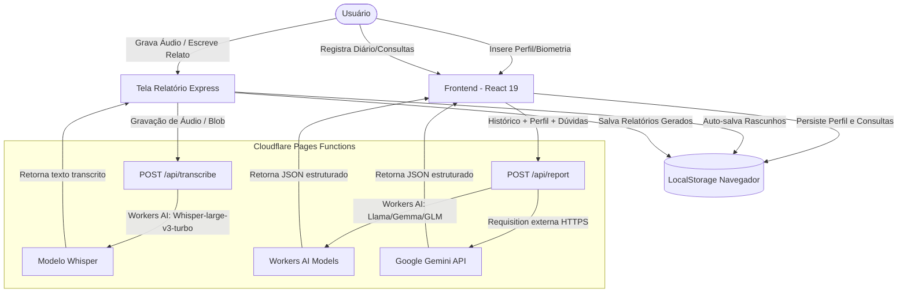

# Relatório Técnico: Fluxo de Dados, Segurança e Riscos LGPD - Diário Intestinal

Este relatório apresenta uma análise técnica minuciosa da arquitetura de dados, fluxos de informação, integrações externas, segurança e conformidade com a LGPD (Lei Geral de Proteção de Dados) do projeto **Diário Intestinal**.

---

## 1. FLUXO DE DADOS COMPLETO

O ciclo de vida dos dados e o fluxo de processamento e armazenamento ocorrem da seguinte forma:

### Detalhamento do Fluxo
1. **Entrada de Dados (Inputs)**: O usuário insere dados de perfil, registra eventos diários no diário intestinal (comidas, água, sono, humor, fezes, sintomas de dor, gases, medicamentos, consultas), ou escreve relatos livres e grava áudio na modalidade de Relatório Express.
2. **Processamento do Cliente**: A interface frontend em React centraliza o estado dinâmico dos registros da timeline na memória da aplicação. Os rascunhos de depoimento livre e o perfil são normalizados antes de serem persistidos no dispositivo ou transmitidos.
3. **Comunicação por APIs**:
   - Os áudios gravados são enviados para a rota `/api/transcribe` (Cloudflare Pages Function).
   - O histórico de registros do diário, dados de biometria, consultas e dúvidas são consolidados num prompt de contexto clínico e enviados para a rota `/api/report` (Cloudflare Pages Function).
4. **Processamento no Backend (Servidores de IA)**:
   - A função de transcrição aciona o **Workers AI da Cloudflare** para processar o áudio usando o modelo Whisper.
   - A função de relatório analisa a requisição. Se for escolhido um modelo do Google (ex: Gemini 2.5 Flash), é efetuada uma requisição HTTPS para a API de Linguagem Generativa do Google contendo os dados sensíveis no prompt. Se for um modelo Cloudflare, o processamento ocorre internamente por meio de bindings no Workers AI.
5. **Armazenamento**:
   - **Volátil (Memória)**: Os registros diários inseridos na timeline física residem estritamente no estado do React (`entries` state) e **são eliminados ao atualizar ou recarregar a página**.
   - **Persistente Local (LocalStorage)**: Histórico de relatórios gerados (limite de 10), dados do perfil, consultas agendadas, rascunho de texto e coordenadas de dor no Express são mantidos localmente no browser em texto claro (JSON estruturado).
   - **Banco de Dados**: Atualmente, nenhum. A integração com banco de dados (Supabase) está planejada para a Fase 2 (futura).

---

## 2. DADOS COLETADOS

| Categoria de Dado | Campos Específicos Coletados | Meio de Coleta | Classificação LGPD |
| :--- | :--- | :--- | :--- |
| **Dados Pessoais** | Nome ou apelido (`nome`). | Formulário de Onboarding / Perfil | Pessoal Comum |
| **Dados Sensíveis (Saúde)** | Idade, Peso (kg), Altura (cm). | Onboarding / Perfil | Pessoal Sensível (Saúde) |
| **Dados Sensíveis (Saúde)** | Condições pré-existentes (Diabetes, Hipertensão, Alterações de Tireoide, Doença Celíaca, Intolerância a Lactose, Sensibilidade ao Glúten, Outras). | Onboarding / Perfil | Pessoal Sensível (Saúde) |
| **Dados Sensíveis (Saúde)** | Consistência de fezes (Escala de Bristol 1 a 7), Cor, Odor, Nível de Esforço evacuatório, Tempo de evacuação, Nível de conforto pós-evacuação. | Formulário de Evacuação (Diário) | Pessoal Sensível (Saúde) |
| **Dados Sensíveis (Saúde)** | Ingestão de água (número de copos). | Formulário de Hidratação (Diário) | Pessoal Sensível (Saúde) |
| **Dados Sensíveis (Saúde)** | Alimentação (ingredientes descritos, tags de categorias, nível de saciedade, velocidade da refeição). | Formulário de Refeições (Diário) | Pessoal Sensível (Saúde) |
| **Dados Sensíveis (Saúde)** | Qualidade e anotações sobre o sono. | Formulário de Sono (Diário) | Pessoal Sensível (Saúde) |
| **Dados Sensíveis (Saúde)** | Intensidade do humor (1 a 5) e sentimentos vivenciados. | Formulário de Humor (Diário) | Pessoal Sensível (Saúde) |
| **Dados Sensíveis (Saúde)** | Exercício físico (tipo, duração, intensidade). | Formulário de Exercício (Diário) | Pessoal Sensível (Saúde) |
| **Dados Sensíveis (Saúde)** | Gases (intensidade, odor, alívio, som). | Formulário de Gases (Diário) | Pessoal Sensível (Saúde) |
| **Dados Sensíveis (Saúde)** | Sintoma de dor (intensidade, localização anatômica na silhueta em coordenadas x/y, tipo de dor). | Formulário de Dor / Mapa Corporal | Pessoal Sensível (Saúde) |
| **Dados Sensíveis (Saúde)** | Medicamentos tomados (nomes, tags de categorias). | Formulário de Medicamentos (Diário) | Pessoal Sensível (Saúde) |
| **Dados Sensíveis (Saúde)** | Anotações médicas, especialidade e conduta de consultas. | Registro de Consultas (Diário) | Pessoal Sensível (Saúde) |
| **Dados Sensíveis (Saúde)** | Áudio gravado e relatos livres contendo queixas físicas. | Modalidade Relatório Express (Áudio/Texto) | Pessoal Sensível (Saúde) |
| **Dados Técnicos** | Endereço IP do dispositivo, User-Agent, cabeçalhos de requisição e timestamp. | Logs automáticos na borda de rede (Cloudflare) | Dado Técnico |
| **Dados Comportamentais** | Votações de qualidade do modelo de IA (`tlgut_model_votes`) e seleção de perguntas de saúde preferidas pelo usuário (`tlgut_selected_questions`). | Salvo localmente (LocalStorage) | Dado Técnico / Pessoal |

---

## 3. INTEGRAÇÕES EXTERNAS

O projeto faz conexões em trânsito com os seguintes fornecedores externos de serviços:

### A. Cloudflare (Pages & Workers AI)
- **Dado Enviado**:
  - Arquivo de áudio gravado em formato blob (áudio/webm ou áudio/mp4) contendo relatos de saúde do paciente.
  - Prompt estruturado em texto contendo dados de saúde, perfil (nome, idade, peso, condições) e registros do diário (para os modelos de IA da Cloudflare).
- **Quando é enviado**: No momento em que o usuário finaliza uma gravação de voz na interface ou solicita a geração de relatórios utilizando modelos operados na infraestrutura da Cloudflare.
- **Finalidade**: Realizar a transcrição de voz para texto (Speech-to-Text) com os modelos Whisper; gerar o relatório diagnóstico/perguntas estruturadas sob modelos LLM hospedados na Cloudflare (Llama, Gemma, GLM, etc.).

### B. Google (Generative Language API)
- **Dado Enviado**: Prompt textual parametrizado contendo o Nome do Paciente, idade, biometria, condições crônicas pré-existentes, histórico de registros diários (dores, fezes, humor, alimentos, notas livres) ou narrativa do Express, e dúvidas registradas.
- **Quando é enviado**: Sempre que o usuário solicita o Relatório de Período ou o Relatório Express selecionando os modelos `@google/gemini-2.5-flash` ou `@google/gemini-2.5-flash-lite`.
- **Finalidade**: Processamento de inteligência artificial generativa para criar a estrutura JSON do relatório médico do paciente.

### C. Pagamentos (Hotmart, Stripe, etc.) e Banco de Dados (Supabase)
- **Status Atual**: **Não implementados**. O código atual não possui integrações ativas com Stripe, Hotmart ou banco de dados externo. Há apenas rascunhos de planos futuros em arquivos de requisitos.

---

## 4. ARMAZENAMENTO DE DADOS

- **Onde os dados ficam armazenados**: Inteiramente localizados no navegador do dispositivo do usuário utilizando a API do `LocalStorage`.
- **Região**: O armazenamento persistente ocorre fisicamente no próprio dispositivo do usuário. Em trânsito, as requisições passam pela borda global da rede CDN da Cloudflare (com nós no Brasil e globalmente) e são transmitidas para processamento de IA nos datacenters da Cloudflare e do Google (localizados principalmente nos EUA).
- **Cache, Logs ou Backups**:
  - **Backups**: Não existem backups no servidor, pois não há armazenamento em banco de dados na nuvem.
  - **Logs**: O tráfego de requisições web passa pelo roteamento do Cloudflare Pages, gerando logs automáticos de servidores de borda (Request Logs contendo IP, cabeçalhos técnicos, data e hora) úteis para diagnóstico operacional da infraestrutura.
  - **Cache**: Não há cache ativo de banco de dados ou sessões de relatórios no backend. O único cache existente são os ativos estáticos do frontend controlados pelo Service Worker (`sw.js`) do navegador para funcionamento offline (PWA).

---

## 5. AUTENTICAÇÃO E SEGURANÇA

- **Mecanismo de Login**: **Não há**. O sistema funciona de forma aberta sem autenticação. Não há uso de tokens JWT, Cookies de sessão ou fluxos OAuth.
- **Criptografia**:
  - **Em Trânsito**: Obrigatória. Toda comunicação de requisição entre o cliente (navegador) e o backend (Cloudflare Pages Functions) e as APIs de IA é realizada utilizando criptografia SSL/TLS sob protocolo HTTPS.
  - **Em Repouso**: **Inexistente**. Os dados sensíveis de saúde e biometria salvos no `LocalStorage` do navegador estão armazenados em texto claro (formato JSON plano), sem nenhum tipo de criptografia do lado do cliente.
- **Controle de Acesso (RLS / Roles)**: Não há controle de acesso, restrição de perfil ou proteção por banco de dados. Qualquer pessoa ou software com acesso físico/lógico ao navegador do usuário pode ler as informações armazenadas no `LocalStorage`. O controle de RLS (Row Level Security) não está presente no código, sendo uma pendência de arquitetura para a Fase 2 (Supabase).

---

## 6. FUNCIONALIDADES DO USUÁRIO

- **Editar dados**: O usuário pode alterar suas informações de perfil biométrico e condições pré-existentes a qualquer instante. Rascunhos de texto e marcações de dor do relatório Express são mutáveis na tela de edição.
- **Excluir dados**:
  - É possível excluir registros de eventos diários específicos da timeline do dia (por meio do botão de lixeira, manipulando o estado React local).
  - É possível deletar consultas e relatórios gerados individuais salvos localmente.
  - **Observação**: Não há uma função explícita de "limpeza completa rápida" ou "excluir conta", mas os dados da timeline principal desaparecem espontaneamente se o usuário reiniciar a aba ou recarregar o navegador.
- **Exportar**: O aplicativo disponibiliza a geração de arquivos PDF contendo as consultas e relatórios clínicos formatados. Esta operação é realizada de modo 100% cliente (local) no navegador com a biblioteca `jsPDF`.

---

## 7. REGRAS DE NEGÓCIO

- **Limites de Armazenamento de Relatórios**: O histórico de relatórios unificados no `LocalStorage` tem capacidade máxima de **10 itens**. Ao atingir esse limite, a rotina aplica a estratégia FIFO (First-In, First-Out), eliminando permanentemente o relatório mais antigo salvo para abrir espaço para o novo.
- **Limites de Entrada para IA**: O array de dados enviado à IA é limitado a no máximo 200 registros de diário. Caso a representação textual dos dados passe de 35.000 caracteres, a requisição é rejeitada pela camada de validação.
- **Retenção e Exclusão Automática**: Sem políticas de exclusão programada no backend, uma vez que não há gravação de banco de dados. Os dados duram enquanto o `LocalStorage` do navegador persistir.

---

## 8. USO DE IA

- **Modelos de IA**:
  - `@google/gemini-2.5-flash` (Padrão para relatórios)
  - `@google/gemini-2.5-flash-lite` (Fallback de relatórios)
  - `@cf/openai/whisper-large-v3-turbo` (Padrão para transcrição de áudio)
  - Modelos da Cloudflare adicionais para relatórios: `@cf/meta/llama-4-scout-17b-16e-instruct`, `@cf/google/gemma-4-26b-a4b-it`, `@cf/zai-org/glm-4.7-flash` e `@cf/openai/gpt-oss-120b`.
- **Momento das Chamadas**:
  - O Whisper é acionado sob demanda imediata assim que o usuário conclui o envio de um registro de voz na interface do Relatório Express.
  - Os modelos de LLM para relatórios são acionados sob demanda no clique em "Gerar Relatório".
- **Dados Enviados para a IA**: Registros consolidados de eventos de saúde e diário dos últimos dias (sintomas intestinais, dores, evacuações e notas de texto), biometria do perfil (incluindo o **Nome do usuário**), dúvidas escritas pelo paciente e dados da próxima consulta.
- **Anonimização**: **Não há anonimização**. Os dados são enviados ao modelo integrando os dados nominativos reais cadastrados pelo usuário no perfil ("Nome: [Nome real do usuário]").

---

## 9. COOKIES E TRACKING

- **Cookies**: Não há cookies funcionais ou de rastreamento configurados no frontend ou backend. A sessão é controlada localmente.
- **Analytics / Tracking**: Ausência total de tags de monitoramento comportamental (Google Analytics, Hotjar, Mixpanel ou semelhantes) mapeadas nas estruturas de código examinadas.

---

## 10. RISCOS DE LGPD DETECTADOS

Pela natureza das informações tratadas, o aplicativo lida fundamentalmente com **Dados Pessoais Sensíveis de Saúde** (art. 5º, II da LGPD), exigindo um padrão rigoroso de proteção de dados. Foram encontrados os seguintes riscos críticos:

### A. Pontos de Exposição de Dados Sensíveis
1. **Dados de Saúde Expostos no LocalStorage em Texto Limpo**: 
   - A persistência local em formato de texto desprotegido expõe o usuário a vazamento de histórico médico em dispositivos compartilhados ou em caso de perda/furto do equipamento.
   - Qualquer vulnerabilidade XSS (injeção de script malicioso de terceiros) dá acesso imediato a todo o histórico de relatórios gerados pelo usuário, inclusive com os nomes reais.
2. **Exposição Nominativa na IA**:
   - O envio do nome real do usuário nos prompts enviados ao Google e à Cloudflare é desnecessário para o diagnóstico do modelo e eleva o nível de exposição em caso de vazamento na infraestrutura das provedoras de IA.

### B. Transferência Internacional de Dados sem Consentimento ou Amparo Legal
- As requisições direcionadas para os modelos do Google Gemini realizam o tráfego transfronteiriço de informações de saúde do usuário (enviadas a servidores nos EUA). 
- O art. 33 da LGPD restringe a transferência internacional de dados pessoais a cenários com salvaguardas adequadas ou mediante consentimento explícito, específico e destacado do titular para esta transferência, o que não ocorre na plataforma hoje.

### C. Ausência Completa de Consentimento Explicito (Opt-in) e Transparência
- **Falta de Opt-In de Consentimento**: Para o tratamento de dados pessoais sensíveis, a regra geral da LGPD requer o consentimento do titular de forma "fornecida por escrito ou por outro meio que demonstre a manifestação de vontade, de forma específica e destacada, para finalidades determinadas" (Art. 11, I). O aplicativo inicia a coleta de dados de saúde no onboarding sem exibir ou recolher esse consentimento prévio.
- **Inexistência de Política de Privacidade**: O usuário não é informado de forma transparente sobre a finalidade específica do processamento dos seus sintomas, quem são os operadores que recebem os dados (Google e Cloudflare), quanto tempo os dados ficam salvos e onde o tráfego é processado.

### D. Fragilidade no Exercício de Direitos do Titular (Eliminação)
- Embora a exclusão local limpe os relatórios na interface, o usuário não possui controle de exclusão total unificada de rastros no `LocalStorage` por meio de um botão como "Excluir meus dados pessoais".

---

## 🛡️ PLANO DE MITIGAÇÃO PROPOSTO

Para mitigar os riscos de conformidade da LGPD identificados, recomenda-se a adoção imediata das seguintes medidas de engenharia e produto:

1. **Anonimização de Dados nos Prompts de IA**: 
   - Modificar a função `buildProfileBlock` em [report.js](file:///f:/tlgut/Tlgut2/functions/api/report.js#L452) para remover o nome do paciente antes do envio à API de IA, utilizando termos genéricos como "Paciente" ou referências genéricas de sexo/idade.
2. **Implementação de Banner de Consentimento / Política de Privacidade**:
   - Adicionar uma etapa inicial obrigatória no [OnboardingModal.jsx](file:///f:/tlgut/Tlgut2/src/components/OnboardingModal.jsx) contendo o aceite explícito dos Termos de Uso e Política de Privacidade de Saúde, alertando o usuário sobre a transferência internacional temporária para processamento de inteligência artificial (Google Gemini).
3. **Criptografia dos Dados Locais**:
   - Adotar criptografia simétrica simples no cliente (utilizando chaves derivadas de variáveis locais ou PIN do usuário) para mascarar os dados salvos no `LocalStorage`, evitando leitura direta em texto claro em caso de invasão física ou lógica do navegador.
4. **Opção de Exclusão Completa (Purge Local)**:
   - Adicionar uma função de "Limpar Todos os Dados e Configurações" na aba de Perfil, que chame explicitamente `localStorage.clear()` (ou limpe todas as chaves do aplicativo `tlgut_*`), garantindo o direito do titular à eliminação rápida de seus registros locais de saúde.
